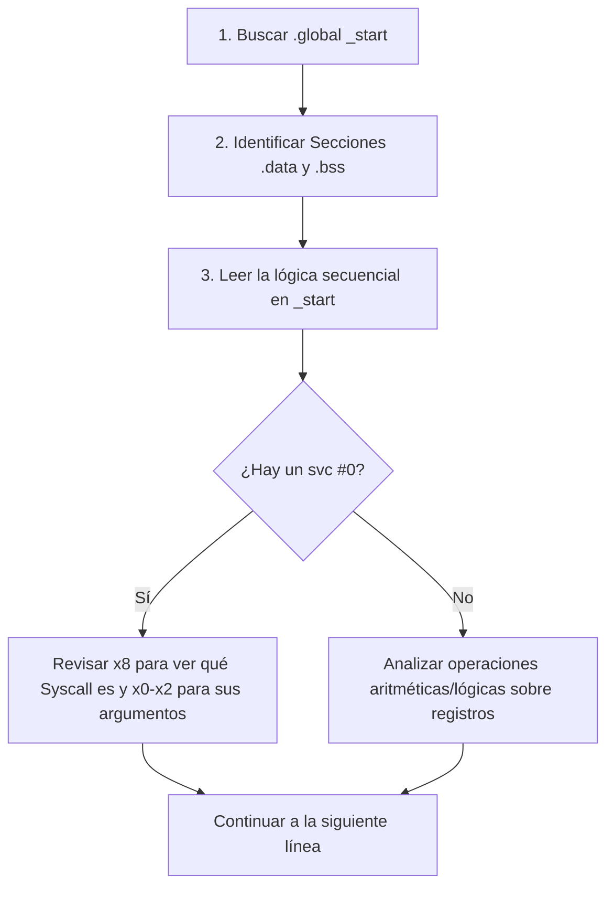

# Guía Definitiva de Estudio: Ensamblador ARM64 (AArch64)

Esta guía ha sido diseñada para ayudarte a entender la arquitectura ARM64, la sintaxis del ensamblador AArch64 utilizado en tu entorno académico, los registros del procesador, las directivas y cómo interpretar cualquier código ensamblador paso a paso.

---
## 1. Fundamentos de la Arquitectura ARM64 (AArch64)

ARM64 es una arquitectura de tipo **RISC** (Reduced Instruction Set Computer - Computador con Conjunto de Instrucciones Reducidas). A diferencia de x86 (CISC), en ARM64:
* **Arquitectura Load-Store:** La CPU no puede realizar operaciones aritméticas directamente sobre datos en la memoria RAM. Primero debe **cargar** los datos de la memoria a los registros (`LDR`), realizar la operación en la CPU, y luego **almacenar** el resultado de vuelta en la memoria (`STR`).
* **Instrucciones de tamaño fijo:** Todas las instrucciones de máquina ocupan exactamente 32 bits (4 bytes) de longitud, lo que facilita la alineación y la velocidad de ejecución.

---

## 2. Los Registros en ARM64

Los registros son celdas de almacenamiento de súper alta velocidad integradas directamente en la CPU. En ARM64 disponemos de los siguientes registros de propósito general y especial:

### Registros de Propósito General (`x0` a `x30` / `w0` a `w30`)
Cada uno de los 31 registros puede ser accedido en dos tamaños:
* **Registros `X` (64 bits):** Acceden a la totalidad de los 64 bits de datos (`x0` a `x30`). Se usan para direcciones de memoria (punteros) y enteros de 64 bits.
* **Registros `W` (32 bits):** Representan la mitad menos significativa (los 32 bits inferiores) del registro `X` correspondiente (`w0` a `w30`). Cuando escribes en un registro `W`, la mitad superior del registro `X` se llena automáticamente con ceros.

```
 Registro X (64 bits)
 ┌───────────────────────────────────────┬───────────────────────────────────────┐
 │       Bits Superiores (63 - 32)       │       Bits Inferiores (31 - 0)        │
 ├───────────────────────────────────────┼───────────────────────────────────────┤
 │                 zeros                 │              Registro W               │
 └───────────────────────────────────────┴───────────────────────────────────────┘
```

#### Roles Convenidos de los Registros (ABI - Application Binary Interface)
Para que los compiladores (como GCC) y las funciones escritas por humanos se entiendan entre sí, se han establecido reglas sobre el uso de cada registro:

| Registros | Nombre / Rol | Descripción |
| :--- | :--- | :--- |
| **`x0` - `x7`** | Argumentos / Retorno | Pasan argumentos a funciones y llamadas al sistema. El valor de retorno de una función o código de salida se coloca en **`x0`** (o `w0`). |
| **`x8`** | Número de Syscall | En Linux ARM64, almacena el número identificador de la llamada al sistema (`syscall`) que se va a invocar con `svc #0`. |
| **`x9` - `x15`** | Temporales (*Caller-saved*) | Pueden ser modificados libremente por cualquier función. Si necesitas guardar su valor antes de llamar a una función, debes respaldarlo tú mismo (en la pila). |
| **`x16` - `x17`** | Temporales Intra-llamada | Usados internamente por el enlazador dinámico. |
| **`x18`** | Registro de Plataforma | Reservado para uso del sistema operativo. |
| **`x19` - `x28`** | Preservados (*Callee-saved*) | Si una función requiere usar estos registros, está obligada a guardar su contenido original en la pila y restaurarlo antes de retornar. |
| **`x29` (`fp`)** | *Frame Pointer* | Puntero de marco de pila. Ayuda a rastrear el inicio del marco de la función activa en la pila de llamadas. |
| **`x30` (`lr`)** | *Link Register* | Almacena la dirección de retorno cuando haces un salto de función con `bl`. Al terminar la función, la instrucción `ret` salta a la dirección guardada aquí. |

### Registros Especiales
* **`sp` (Stack Pointer):** Puntero de pila. Apunta al tope actual de la pila en memoria (debe estar alineado a 16 bytes).
* **`pc` (Program Counter):** Contador de programa. Contiene la dirección de memoria de la instrucción actual que se está ejecutando. No se puede modificar directamente con un `mov`, solo mediante saltos (`b`, `bl`, `ret`).
* **`xzr` / `wzr` (Zero Register):** Registro Cero. Es un registro de solo lectura que siempre contiene el valor cero (`0`). Sirve para limpiar registros o hacer comparaciones rápidas sin gastar memoria.

---

## 3. Secciones y Estructura de Memoria en un Programa Ensamblador

Un programa se organiza en diferentes "secciones" o segmentos de memoria con diferentes permisos:

1. **Sección `.text` (Código):**
   * Contiene las instrucciones en lenguaje máquina que ejecutará el procesador.
   * Es de **solo lectura y ejecutable**.
2. **Sección `.data` (Datos inicializados):**
   * Contiene variables globales o estáticas que ya tienen un valor asignado desde el inicio (ej. arreglos inicializados, cadenas de texto).
   * Es de **lectura y escritura, no ejecutable**.
3. **Sección `.bss` (Datos no inicializados):**
   * Reserva espacio para variables que se inicializarán durante la ejecución. No ocupan espacio en el archivo ejecutable final; el sistema operativo les asigna memoria limpia (en ceros) al cargar el programa.
   * Es de **lectura y escritura, no ejecutable**.

---

## 4. Instrucciones Fundamentales de ARM64

### A. Operaciones de Carga y Almacenamiento (Memory Access)
Recuerda: la CPU no opera directamente sobre la RAM, por lo que estas instrucciones son el puente.
* **`LDR Rt, =etiqueta`**: Carga la **dirección de memoria** de una variable en el registro `Rt`.
* **`LDR Rt, [Rn]`**: Carga el **contenido** apuntado por la dirección que está en `Rn` hacia el registro `Rt`.
* **`LDR Rt, [Rn, #desplazamiento]`**: Carga el contenido de la dirección `Rn + desplazamiento` en bytes.
* **`STR Rt, [Rn]`**: Almacena el **contenido** del registro `Rt` en la dirección de memoria apuntada por `Rn`.
* **`STRB / LDRB`**: Almacenan/cargan un **byte** (8 bits). Muy útiles para tipos `.byte` y caracteres individuales de cadenas.
* **`STRH / LDRH`**: Almacenan/cargan una **media palabra** (16 bits).

### B. Movimiento de Datos
* **`MOV Rd, inmediato`**: Mueve un valor constante (inmediato) al registro `Rd` (máximo 16 bits de valor).
* **`MOV Rd, Rn`**: Copia el contenido del registro `Rn` al registro `Rd`.
* **`MOVZ Rd, inmediato, lsl #shift`**: Mueve un valor de 16 bits desplazado a la izquierda, limpiando (llenando con ceros) el resto del registro.
* **`MOVK Rd, inmediato, lsl #shift`**: Modifica (Keep) únicamente los 16 bits seleccionados del registro `Rd`, manteniendo intacto el resto.

### C. Aritmética y Lógica
* **`ADD Rd, Rn, Rm`**: Suma: `Rd = Rn + Rm`.
* **`SUB Rd, Rn, Rm`**: Resta: `Rd = Rn - Rm`.
* **`MUL Rd, Rn, Rm`**: Multiplica: `Rd = Rn * Rm`.
* **`SDIV Rd, Rn, Rm`**: División entera con signo (Signed Division): `Rd = Rn / Rm`.
* **`NEG Rd, Rm`**: Calcula el complemento a dos (cambia el signo algebraico): `Rd = -Rm`.
* **`AND Rd, Rn, Rm`**: Operación bitwise AND.
* **`ORR Rd, Rn, Rm`**: Operación bitwise OR.

### D. Desplazamientos de Bits (Shifts)
* **`LSR Rd, Rn, #N`** (Logical Shift Right): Desplaza los bits de `Rn` a la derecha $N$ veces. Equivale a realizar una división entera por $2^N$.
* **`LSL Rd, Rn, #N`** (Logical Shift Left): Desplaza los bits de `Rn` a la izquierda $N$ veces. Equivale a multiplicar por $2^N$.
* **`LSLV Rd, Rn, Rm`**: Desplazamiento variable a la izquierda utilizando el número de bits especificado en el registro `Rm`.

---

## 5. Directivas del Ensamblador (GNU Assembler - GAS)

Las directivas son instrucciones dirigidas al **ensamblador** (el compilador de código fuente a código máquina) y no al procesador directamente. Se reconocen porque comienzan con un punto (`.`):

* **`.global _start`**: Declara un símbolo como visible para el enlazador (`ld`). Define el punto de entrada del programa.
* **`.equ max, 100`**: Define una constante simbólica. El ensamblador sustituye el nombre por el valor antes de compilar (no consume memoria).
* **`.align N` o `.balign M`**: Alineación de memoria. `.balign 16` asegura que la siguiente instrucción o dato comience en una dirección de memoria múltiplo de 16 bytes. Si hay espacios vacíos, se rellenan con instrucciones `NOP`.
* **`.word`**: Define enteros de 32 bits (4 bytes).
* **`.byte`**: Define enteros de 8 bits (1 byte).
* **`.string "texto"`**: Define una cadena de caracteres terminada en un byte nulo (`\0`).
* **`.ascii "texto"`**: Define una cadena de caracteres sin terminador nulo.
* **`.space N`**: Reserva `N` bytes de memoria vacía (usualmente en la sección `.bss`).

---

## 6. Las Llamadas al Sistema (Syscalls) en Linux ARM64

Cuando un programa necesita realizar operaciones con el mundo exterior (escribir en consola, leer teclado, pedir memoria, terminar ejecución), no puede hacerlo por sí mismo por motivos de seguridad del procesador. Debe pedirle permiso al sistema operativo. Esto se hace mediante una **Llamada al Sistema** (Syscall).

### ¿Cómo funciona la instrucción `svc #0`?
1. Se configuran los argumentos requeridos en los registros de entrada (`x0` a `x7`).
2. Se escribe el identificador de la llamada en el registro **`x8`**.
3. Se invoca **`svc #0`** (Supervisor Call). El procesador interrumpe la ejecución del programa, cede el control al Kernel de Linux, este realiza la tarea, deposita el resultado de la operación en **`x0`** y devuelve el control al programa.

### Tabla de Syscalls Comunes de Linux ARM64

| Syscall ID (`x8`) | Nombre | Argumento `x0` | Argumento `x1` | Argumento `x2` | Acción |
| :---: | :--- | :--- | :--- | :--- | :--- |
| **63** | `read` | File Descriptor (0 = teclado) | Puntero a buffer | Tamaño del buffer | Lee bytes desde la entrada estándar. |
| **64** | `write` | File Descriptor (1 = pantalla) | Puntero a cadena | Cantidad de bytes | Imprime texto en la salida estándar. |
| **93** | `exit` | Código de retorno (0 = éxito) | - | - | Termina el programa inmediatamente. |
| **214** | `brk` | Límite del segmento (0 para consultar) | - | - | Asigna o libera memoria dinámica (heap). |

---

## 7. Metodología para Leer y Entender Código Ensamblador

Cuando te enfrentes a un archivo `.s`, sigue este orden de análisis para no perderte:



### Ejemplo Práctico: Análisis Detallado de `suma_digitos.s`

Para entender cómo funciona el programa de suma, analicemos el flujo completo cuando el usuario ingresa texto por consola y el programa suma sus dígitos.

#### Paso A: Lectura desde el teclado (Syscall `read`)
```assembly
    // 2. Leer la entrada del usuario
    mov x0, #0          // x0 = 0 (file descriptor: stdin - teclado)
    ldr x1, =buffer     // x1 = Dirección de memoria donde se guardará lo que escriba el usuario
    mov x2, #10         // x2 = Leer hasta 10 bytes
    mov x8, #63         // x8 = 63 (Código de Syscall para 'read')
    svc #0              // Ejecuta la llamada al sistema. Pausa y espera que presiones Enter.
```
* **Qué sucede aquí:** Si el usuario teclea `375` y pulsa Enter, en la variable `buffer` de la memoria RAM se guardan los bytes individuales de los caracteres correspondientes:
  * El primer byte contiene el carácter **`'3'`** (cuyo valor numérico en código ASCII es **`51`**).
  * El segundo byte contiene el carácter **`'7'`** (cuyo valor numérico en código ASCII es **`55`**).
  * El tercer byte contiene el carácter **`'5'`** (cuyo valor numérico en código ASCII es **`53`**).

#### Paso B: Carga y Conversión de ASCII a Entero
Dado que la CPU tiene los valores ASCII (`51`, `55`, `53`) y no los números reales (`3`, `7`, `5`), debemos realizar una conversión matemática restando el valor del carácter cero (`'0'`, que vale `48` en decimal).

```assembly
    ldr x1, =buffer     // Carga la dirección base del buffer en x1 (funciona como un puntero).
    
    // 1. Obtener y convertir el primer dígito ('3')
    ldrb w2, [x1, #0]   // LDRB (Load Register Byte) lee exactamente 1 byte del buffer en la posición offset 0.
                        // El registro w2 ahora tiene el valor ASCII 51.
    sub w2, w2, #48     // Resta 48 al registro w2 (51 - 48 = 3).
                        // ¡Ahora w2 tiene el entero real 3!

    // 2. Obtener y convertir el segundo dígito ('7')
    ldrb w3, [x1, #1]   // Lee el byte en la posición offset 1 (1 byte a la derecha de la base).
                        // El registro w3 ahora tiene el valor ASCII 55.
    sub w3, w3, #48     // Resta 48 al registro w3 (55 - 48 = 7).
                        // ¡Ahora w3 tiene el entero real 7!

    // 3. Obtener y convertir el tercer dígito ('5')
    ldrb w4, [x1, #2]   // Lee el byte en la posición offset 2 (2 bytes a la derecha de la base).
                        // El registro w4 ahora tiene el valor ASCII 53.
    sub w4, w4, #48     // Resta 48 al registro w4 (53 - 48 = 5).
                        // ¡Ahora w4 tiene el entero real 5!
```

#### Paso C: Sumar los valores convertidos
Una vez que tenemos los números enteros limpios en los registros `w2` (3), `w3` (7) y `w4` (5), los sumamos secuencialmente:
```assembly
    add w0, w2, w3      // Suma w2 (3) y w3 (7). Almacena el resultado temporal (10) en w0.
    add w0, w0, w4      // Suma el valor actual de w0 (10) y w4 (5). Almacena el resultado final (15) en w0.
```

#### Paso D: Salida del programa con el resultado
```assembly
    mov x8, #93         // x8 = 93 (Código de Syscall para 'exit')
    svc #0              // Termina el programa. El valor en x0 (que es 15) se devuelve al sistema operativo.
```
Si ejecutas el programa en la terminal y luego escribes `echo $?`, verás en pantalla el número **`15`**.

---

## 8. Glosario de Abreviaturas y Mnemónicos en ARM64

Efectivamente, todas las abreviaturas y nombres de instrucciones en ensamblador provienen del **inglés**. A continuación se detalla el significado original y la traducción/explicación de cada término utilizado:

### A. Instrucciones y Mnemónicos (Mnemonics)

| Abreviatura | Nombre en Inglés | Significado en Español | Explicación |
| :--- | :--- | :--- | :--- |
| **`MOV`** | **Mov**e | Mover / Copiar | Copia un valor a un registro (ej. `mov x0, 5`). |
| **`MOVZ`** | **Mov**e with **Z**ero | Mover con Ceros | Carga un valor de 16 bits limpiando los demás bits con ceros. |
| **`MOVK`** | **Mov**e with **K**eep | Mover y Mantener | Modifica 16 bits específicos sin alterar el resto del registro. |
| **`LDR`** | **L**oa**d** **R**egister | Cargar Registro | Lee datos desde la memoria RAM hacia un registro. |
| **`LDRB`** | **L**oa**d** **R**egister **B**yte | Cargar Byte | Lee un solo byte (8 bits) desde la memoria. |
| **`STR`** | **St**o**r**e **R**egister | Almacenar Registro | Escribe datos desde un registro hacia la memoria RAM. |
| **`STRB`** | **St**o**r**e **R**egister **B**yte | Almacenar Byte | Escribe un solo byte (8 bits) de un registro en la memoria. |
| **`ADD`** | **Add** | Sumar | Suma dos valores. |
| **`SUB`** | **Sub**tract | Restar | Resta dos valores. |
| **`MUL`** | **Mul**tiply | Multiplicar | Multiplica dos valores. |
| **`SDIV`** | **S**igned **Div**ision | División con Signo | Divide dos números (soporta positivos y negativos). |
| **`UDIV`** | **U**nsigned **Div**ision | División sin Signo | Divide dos números (solo enteros positivos). |
| **`NEG`** | **Neg**ate | Negar / Invertir | Cambia el signo de un número (complemento a dos). |
| **`SVC`** | **S**uper**v**isor **C**all | Llamada al Supervisor | Solicita una operación al sistema operativo (Syscall). |
| **`LSL`** | **L**ogical **S**hift **L**eft | Desplazamiento Lógico Izquierda | Mueve bits a la izquierda (multiplica por potencias de 2). |
| **`LSR`** | **L**ogical **S**hift **R**ight | Desplazamiento Lógico Derecha | Mueve bits a la derecha (divide por potencias de 2). |
| **`LSLV`** | **L**ogical **S**hift **L**eft **V**ariable| Desplazamiento Izquierda Variable | Desplaza bits a la izquierda según el valor de otro registro. |
| **`AND`** | Bitwise **AND** | "Y" lógico | Operación lógica bit por bit (máscaras). |
| **`ORR`** | Bitwise **OR** (**OR R**egister) | "O" lógico | Operación lógica OR bit por bit (unión de bits). |
| **`EOR`** | **E**xclusive **OR** | "O" exclusivo (XOR) | Operación lógica XOR bit por bit. |
| **`B`** | **B**ranch | Bifurcación / Salto | Salto directo a otra parte del código (etiqueta). |
| **`BL`** | **B**ranch with **L**ink | Bifurcación con Enlace | Salta a una subrutina/función y guarda la dirección de retorno. |
| **`RET`** | **Ret**urn | Retornar | Vuelve de una función saltando a la dirección del Link Register (`x30`). |
| **`NOP`** | **N**o **O**peration | Sin Operación | Instrucción que no hace nada, usada para alineación de memoria. |

### B. Registros y Conceptos Especiales

| Abreviatura | Nombre en Inglés | Significado en Español | Explicación |
| :--- | :--- | :--- | :--- |
| **`SP`** | **S**tack **P**ointer | Puntero de Pila | Apunta al final (tope) de la pila temporal en memoria. |
| **`PC`** | **P**rogram **C**ounter | Contador de Programa | Contiene la dirección de la instrucción en ejecución. |
| **`LR`** | **L**ink **R**egister | Registro de Enlace | Guarda el punto de retorno al llamar a funciones (`x30`). |
| **`FP`** | **F**rame **P**ointer | Puntero de Marco | Lleva el control del bloque de la función activa en la pila (`x29`). |
| **`XZR` / `WZR`**| **Z**ero **R**egister | Registro Cero | Registro físico que siempre vale 0 (de 64 o 32 bits). |

### C. Directivas del Ensamblador y Siglas de Arquitectura

| Abreviatura / Sigla | Término en Inglés | Significado en Español | Explicación |
| :--- | :--- | :--- | :--- |
| **`.global`** | **Global** symbol | Símbolo global | Hace que una etiqueta sea visible fuera de este archivo. |
| **`.equ`** | **Equ**ate | Igualar / Constante | Asigna un valor constante a una etiqueta simbólica. |
| **`.align`** | **Align** memory | Alinear memoria | Asegura que los datos se ubiquen en direcciones múltiplos de $2^N$. |
| **`.balign`** | **B**yte **align** memory | Alinear memoria por bytes | Asegura la alineación en bytes directamente. |
| **`.bss`** | **B**lock **S**tarted by **S**ymbol | Bloque Iniciado por Símbolo | Sección de memoria para variables globales sin inicializar. |
| **`RISC`** | **R**educed **I**nstruction **Set** **C**omputer | Computador de Juego de Instrucciones Reducidas | Filosofía de procesadores rápidos con instrucciones simples y fijas. |
| **`ASCII`** | **A**merican **S**tandard **C**ode for **I**nformation **I**nterchange | Código Estándar Americano para el Intercambio de Información | Estándar de codificación de caracteres de texto en números. |
| **`Syscall`** | **Sys**tem **call** | Llamada al sistema | Petición del programa para que el sistema operativo haga algo. |
| **`stdin`** | **St**an**d**ard **in**put | Entrada estándar | Flujo de entrada de datos (el teclado por defecto). |
| **`stdout`** | **St**an**d**ard **out**put | Salida estándar | Flujo de salida de datos (la pantalla de la terminal por defecto). |
